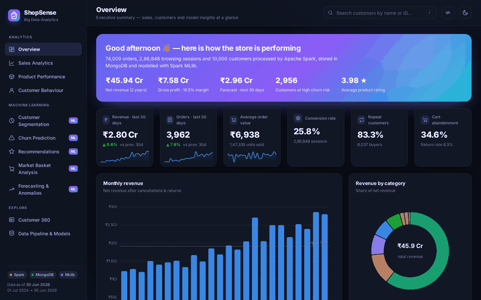
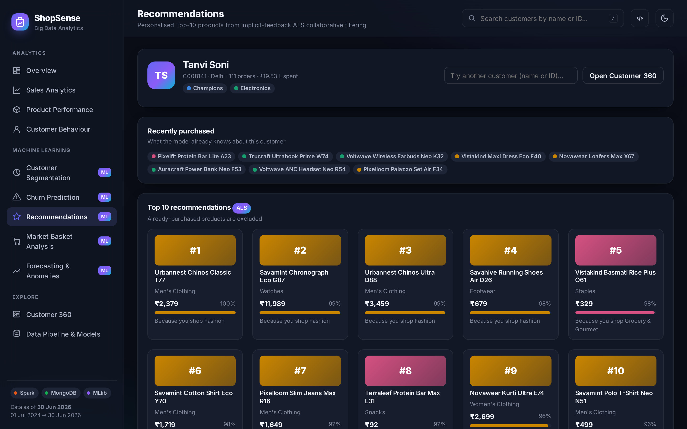
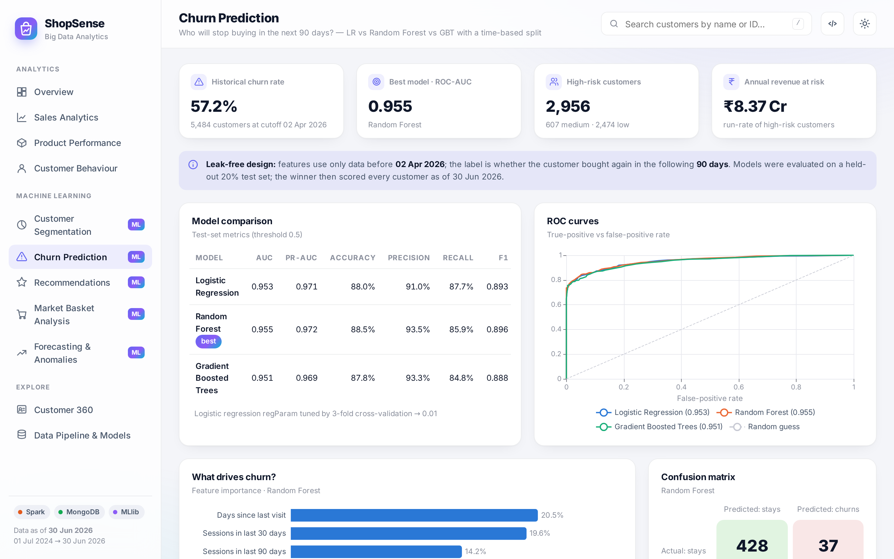
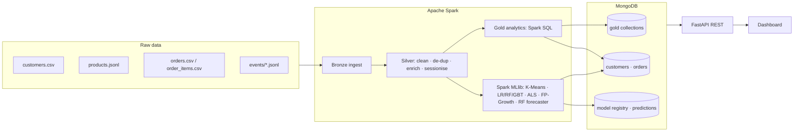

<div align="center">


# ShopSense

### E-Commerce Sales & Customer Behaviour Analytics using Big Data

**Apache Spark · MongoDB · Machine Learning (Spark MLlib) · FastAPI · ECharts**


*A complete end-to-end Big Data analytics platform: a Spark pipeline processes ~1.4 million raw e-commerce records,
stores analytics-ready documents in MongoDB, trains six machine-learning models and serves everything
through a premium interactive dashboard.*



🎬 **Full demo video:** [`docs/demo/shopsense_demo.webm`](docs/demo/shopsense_demo.webm) &nbsp;·&nbsp;
📘 **Report:** [`report/`](report/) &nbsp;·&nbsp; 📊 **Presentation:** [`presentation/`](presentation/)

</div>

---

## 📑 Contents

- [Why ShopSense?](#-why-shopsense)
- [Features](#-features)
- [Screenshots](#-screenshots)
- [Architecture](#-architecture)
- [Tech stack](#-tech-stack)
- [Machine-learning models & results](#-machine-learning-models--results)
- [Quick start](#-quick-start-10-minutes)
- [Project structure](#-project-structure)
- [Dataset](#-dataset)
- [REST API](#-rest-api)
- [Documentation](#-documentation)
- [Troubleshooting](#-troubleshooting)
- [Team](#-team)

---

## 💡 Why ShopSense?

Online stores collect huge volumes of data (orders, product catalogues, customer profiles and click-stream logs), but most of it is never turned into decisions.
ShopSense answers the questions an e-commerce business asks every day:

| Business question | How ShopSense answers it |
|---|---|
| *How are sales trending? Which categories, cities and payment methods drive revenue?* | Spark aggregations + live MongoDB aggregation pipelines with date / category filters |
| *Where do shoppers drop out of the funnel? Do they come back?* | Sessionised click-stream funnel, device / traffic-source comparison and cohort retention |
| *Who are our best customers, and who is slipping away?* | RFM + **K-Means** segmentation and **churn prediction** (LR / Random Forest / GBT) |
| *What should we show each customer?* | **ALS collaborative filtering** recommendations and **FP-Growth** "frequently bought together" rules |
| *What will next month look like? Did something unusual happen?* | Hybrid **trend + seasonality forecaster** with prediction intervals and **anomaly detection** |
| *Which customers should marketing call today?* | Win-back list sorted by predicted 12-month value, exportable as CSV, plus a what-if simulator |

---

## ✨ Features

**Big-data engineering (Apache Spark)**
- Medallion pipeline: **bronze** (schema-on-read ingest of CSV + JSON-lines logs) → **silver** (cleaning, validation, de-duplication, enrichment, sessionisation) → **gold** (analytics tables)
- Automatic **data-quality report**: duplicates, invalid quantities, casing and missing values are fixed and counted per table
- Distributed writes to MongoDB: each Spark partition bulk-inserts its own rows (the official MongoDB Spark Connector is also supported)
- Optional Parquet data lake · every run is timed and logged to a `pipeline_runs` collection

**Analytics dashboard (11 pages)**
- 📈 **Overview**: KPIs with sparklines, monthly revenue, category mix, new vs returning buyers, alerts
- 💰 **Sales**: date-range / category / granularity filters, geo bubble map, heat-map, treemap, payments, sale-event uplift
- 📦 **Products**: searchable catalogue KPIs, view-to-buy conversion, product drawer with similar and bundle items
- 🧭 **Behaviour**: conversion funnel by device / source, hourly traffic, event mix, cohort retention matrix
- 🧩 **Segmentation**: PCA cluster map, silhouette curve, segment playbook and customer lists
- ⚠️ **Churn**: model comparison, ROC curves, feature importance, confusion matrix, **live what-if simulator**, CSV export
- ⭐ **Recommendations**: personalised Top-10 per customer with reasons and offline evaluation
- 🛒 **Market basket**: association-rule explorer and interactive category network graph
- 🔮 **Forecast & anomalies**: 60-day forecast with 80% / 95% bands, baselines, anomaly timeline and validation
- 👤 **Customer 360**: profile, RFM, churn gauge with explanation, spend history, orders (embedded docs) and recommendations
- ⚙️ **Pipeline & models**: architecture, stage timings, DQ report, collections and model registry
- Dark / light theme, global customer search (press `/`), responsive layout, fully offline (fonts and charts are bundled)

---

## 📸 Screenshots

| Overview | Sales analytics |
|---|---|
|  |  |
| **Customer segmentation** | **Churn prediction** |
|  |  |
| **Recommendations** | **Market basket** |
|  |  |
| **Forecast & anomalies** | **Customer 360** |
|  |  |
| **Customer behaviour** | **Light theme** |
|  |  |

More in [`docs/screenshots/`](docs/screenshots/) (every page in dark and light theme).

---

## 🏗 Architecture



Detailed diagrams (use-case, sequence, state, DFD level 0/1, class, activity, ER, deployment) are in [`docs/diagrams/`](docs/diagrams/) and explained in [`docs/ARCHITECTURE.md`](docs/ARCHITECTURE.md).

---

## 🧰 Tech stack

| Layer | Technology | Purpose |
|---|---|---|
| Language | Python 3.11 | pipeline, ML, API |
| Big-data engine | Apache Spark 3.5 (PySpark), Spark SQL | distributed ETL & aggregation |
| Machine learning | Spark MLlib | K-Means, Logistic Regression, Random Forest, GBT, ALS, FP-Growth, RF Regressor, PCA |
| Database | MongoDB 7 / 8 + PyMongo | document store for gold data, predictions & model registry |
| Backend | FastAPI + Uvicorn | REST API with Swagger docs (`/docs`) |
| Frontend | HTML5, CSS3, vanilla JS, Apache ECharts 5 | 11-page single-page dashboard |
| Tooling | pytest, Playwright, Mermaid | tests, screenshots, diagrams |

---

## 🤖 Machine-learning models & results

Results from the default *medium* dataset (10,000 customers · 74 k orders · 1.35 M click-stream events):

| # | Task | Algorithm (Spark MLlib) | Evaluation | Result |
|---|---|---|---|---|
| 1 | Customer segmentation | RFM features → StandardScaler → **K-Means** (k = 3…8) | Silhouette | **k = 5, silhouette 0.375** |
| 2 | Churn prediction (90-day) | **Random Forest** vs Logistic Regression (3-fold CV) vs GBT | ROC-AUC · F1 (held-out 20%) | **AUC 0.955 · F1 0.896 · precision 93.5%** |
| 3 | Product recommendations | Implicit-feedback **ALS** (grid-searched rank / λ / α) | HitRate@10, leave-last-purchase-out | **0.180 = 1.8× the popularity baseline** |
| 4 | Market-basket analysis | **FP-Growth** (product + sub-category level) | support / confidence / lift | 281 rules, lift up to **135×** |
| 5 | Sales forecasting | **LinearRegression trend + RandomForest seasonality** (log scale, smearing correction) | 60-day hold-out MAPE | daily **20.8%** (best of 4), weekly **6.8%** |
| 6 | Anomaly detection | Model-residual **robust z-score (MAD)** + IQR fences | planted ground-truth events | **4 / 4 recovered, 0 false alarms** |

Highlights the dashboard surfaces:
- The top churn signals are **days since last visit**, **sessions in the last 30 days** and **days since last order**. Behavioural (click-stream) features beat purely transactional ones.
- **Big Festive Sale** roughly *doubles* order volume (+100–117%), but deep discounts make its net revenue uplift only +22–30%.
- **Cash-on-Delivery** orders are cancelled twice as often (7.4%) as prepaid orders (≈3.4%).
- The *Champions* segment is 23% of buyers but generates **71.6% of revenue**.

Full methodology and formulas: [`docs/ML_MODELS.md`](docs/ML_MODELS.md).

---

## 🚀 Quick start (≈10 minutes)

### 1. Prerequisites

| Software | Version | Notes |
|---|---|---|
| **Python** | 3.11 (3.9 – 3.11 work) | tick *"Add Python to PATH"* on Windows |
| **Java JDK** | **17** (11 also works) | ⚠️ **Required by Apache Spark.** Download: [Eclipse Temurin 17](https://adoptium.net/temurin/releases/?version=17), then check `java -version` |
| **MongoDB** | Community Server 6 / 7 / 8 | must be running on `localhost:27017` (the Windows installer runs it as a service) |
| RAM / disk | 8 GB RAM, 2 GB free disk | the *small* dataset works on 4 GB |

### 2. Install

**Windows** (Command Prompt, inside the project folder):
```bat
scripts\setup_windows.bat
```
**macOS / Linux**:
```bash
./scripts/setup_unix.sh
```
<details><summary>…or manually</summary>

```bash
python -m venv .venv
.venv\Scripts\activate            # Windows
source .venv/bin/activate         # macOS / Linux
pip install -r requirements.txt
copy .env.example .env            # Windows  (cp on macOS / Linux)
```
</details>

### 3. Run the Big Data pipeline

```bash
python run_pipeline.py --generate                 # generate data + Spark ETL + analytics + ML (~7 min)
python run_pipeline.py --generate --scale small   # lighter run for 4–8 GB laptops (~5 min)
```

<details><summary>Sample output</summary>

```
● Ingest & clean  (bronze → silver)
  ▶ Read raw CSV / JSON-lines (bronze)          ✔    1.9s
  ▶ Clean, validate, de-duplicate, enrich       ✔   31.8s
● Analytics  (silver → gold → MongoDB)
  ▶ Orders collection (embedded items)          ✔    3.8s   (74,009 records)
  ▶ Customer 360 profiles                       ✔    2.6s   (10,000 records)
● Machine learning  (Spark MLlib)
  ▶ Segmentation · K-Means + RFM                ✔   33.3s   (6,037 records)
  ▶ Churn · LR / RF / GBT                       ✔  152.7s   (6,037 records)
  ▶ Recommendations · ALS                       ✔   96.9s   (7,419 records)
  ▶ Market basket · FP-Growth                   ✔    3.5s   (281 records)
  ▶ Forecast + anomaly detection                ✔   51.6s   (9 records)
✔ Pipeline success in 400.1s
```
</details>

### 4. Open the dashboard

```bash
python run_dashboard.py
```
➡️ **http://127.0.0.1:8000** (dashboard) · **http://127.0.0.1:8000/docs** (interactive API docs)

Windows users can also just run `scripts\run_windows.bat` after setup. It runs the pipeline on first use, then starts the dashboard.

### Configuration (`.env`)

| Variable | Default | Meaning |
|---|---|---|
| `MONGO_URI` | `mongodb://localhost:27017` | MongoDB connection string (Atlas works too) |
| `MONGO_DB` | `shopsense` | database name |
| `DATA_SCALE` | `medium` | `small` (2.5 k customers) · `medium` (10 k) · `large` (25 k) |
| `SPARK_DRIVER_MEMORY` | `3g` | lower to `2g` on 8 GB machines if needed |
| `SAVE_PARQUET` | `auto` | Parquet lake (auto-disabled on Windows unless `HADOOP_HOME` is set) |
| `MONGO_SPARK_CONNECTOR` | `false` | `true` = write with the official MongoDB Spark Connector (downloads a JAR) |

---

## 🗂 Project structure

```
BDA/
├── run_pipeline.py            # CLI: generate → Spark ETL → analytics → ML → MongoDB
├── run_dashboard.py           # starts FastAPI + dashboard on :8000
├── requirements.txt · .env.example
├── shopsense/                 # the Big Data / ML package
│   ├── config.py              # settings (.env)
│   ├── spark_session.py       # tuned local SparkSession
│   ├── mongo.py               # BSON conversion + distributed DataFrame → MongoDB writer
│   ├── pipeline.py            # orchestrator, stage timing, run log
│   ├── datagen/               # synthetic e-commerce data generator (personas, seasonality, dirty data)
│   ├── etl/                   # ingest.py (bronze) · clean.py (silver + DQ report)
│   ├── analytics/             # sales.py · behaviour.py (gold tables)
│   └── ml/                    # segmentation · churn · recommender · basket · forecast (+ anomalies)
├── app/
│   ├── main.py                # FastAPI REST API (29 endpoints)
│   └── static/                # dashboard: index.html, css/, js/, vendored ECharts & Inter font
├── tests/                     # pytest unit tests
├── scripts/                   # setup / run scripts, screenshot & demo capture
├── docs/                      # guides, diagrams, screenshots, demo GIF & video
├── report/                    # project report (.docx + .pdf)
└── presentation/              # presentation deck (.pptx + .pdf)
```

---

## 🧾 Dataset

The generator (`shopsense/datagen`) simulates a realistic Indian multi-category marketplace over **2 years (Jul 2024 – Jun 2026)**.
Customers belong to hidden *personas* (loyal, regular, bargain-hunter, occasional, one-time, browser) whose purchase rate, basket size, coupon use and lifetime differ. Demand follows weekends, salary days and Indian sale festivals (Republic Day, Big Festive Sale, Diwali, …), with product bundles, pre-churn engagement decay and 4 planted anomalies.
About 0.5 % dirty records (duplicates, casing, nulls, invalid quantities) are injected on purpose so the cleaning stage has real work.

| File | Format | Rows (medium) |
|---|---|---|
| `customers.csv` | CSV | 10,033 |
| `products.jsonl` | JSON lines | 560 (8 categories, 35 sub-categories) |
| `orders.csv` | CSV | 74,348 |
| `order_items.csv` | CSV | 145,368 |
| `events/events_YYYY-MM.jsonl` | JSON-lines click-stream (24 files) | 1,351,601 |

Full schema: [`docs/DATASET.md`](docs/DATASET.md).

---

## 🔌 REST API

Interactive Swagger documentation is at **`/docs`** while the dashboard is running. A few examples:

| Method | Endpoint | Description |
|---|---|---|
| GET | `/api/overview` | KPIs, monthly trend, categories, alerts |
| GET | `/api/sales/trend?start=2026-01-01&category=Fashion&granularity=week` | live MongoDB aggregation |
| GET | `/api/segments` | K-Means segments, PCA points, silhouette curve |
| GET | `/api/churn/summary` | model comparison, ROC, feature importance |
| POST | `/api/churn/simulate` | what-if churn probability + drivers |
| GET | `/api/churn/customers.csv?risk=High` | win-back campaign export |
| GET | `/api/recommendations/{customer_id}` | ALS Top-10 |
| GET | `/api/basket/rules?level=product&min_lift=5` | FP-Growth rules |
| GET | `/api/forecast?series=Electronics` | forecast + intervals + evaluation |
| GET | `/api/customers/{customer_id}` | Customer 360 profile |

Complete reference: [`docs/API.md`](docs/API.md).

---

## 📚 Documentation

| Document | Contents |
|---|---|
| [`docs/INSTALLATION.md`](docs/INSTALLATION.md) | step-by-step setup for Windows / macOS / Linux, MongoDB & Java installation |
| [`docs/USER_GUIDE.md`](docs/USER_GUIDE.md) | tour of every dashboard page with business use-cases |
| [`docs/ARCHITECTURE.md`](docs/ARCHITECTURE.md) | pipeline design, MongoDB schema, UML diagrams |
| [`docs/ML_MODELS.md`](docs/ML_MODELS.md) | algorithms, formulas, evaluation and results |
| [`docs/API.md`](docs/API.md) | REST endpoints with examples |
| [`docs/DATASET.md`](docs/DATASET.md) | data dictionary and generator design |
| [`report/`](report/) | full project report (KJSIT Major Project-B format) |
| [`presentation/`](presentation/) | slide deck for the project viva |

Run the tests with `pip install pytest && python -m pytest -q`.

---

## 🛠 Troubleshooting

| Problem | Fix |
|---|---|
| `Java gateway process exited` / `JAVA_HOME is not set` | Install JDK 17 and set `JAVA_HOME` (Windows: *System → Environment Variables*); reopen the terminal |
| `Cannot reach MongoDB at mongodb://localhost:27017` | Start MongoDB: Windows → *Services → MongoDB Server → Start*; macOS → `brew services start mongodb-community`; Linux → `sudo systemctl start mongod` |
| `Python worker failed to connect back` (Windows) | Make sure the virtual environment is activated; ShopSense sets `PYSPARK_PYTHON` automatically |
| Warnings about `winutils.exe` / `HADOOP_HOME` on Windows | Harmless: Parquet writing is disabled on Windows by default, everything else works |
| `OutOfMemoryError` | Use `--scale small` or set `SPARK_DRIVER_MEMORY=2g` in `.env` |
| Port 8000 already in use | `python run_dashboard.py --port 8050` |
| Dashboard says *"No data yet"* | Run `python run_pipeline.py` first |

More in [`docs/INSTALLATION.md`](docs/INSTALLATION.md#troubleshooting).

---

## 👥 Team

| Name | Role |
|---|---|
| **Kartik Verma** | Data engineering (Spark ETL, MongoDB), pipeline orchestration |
| **Kushal Soni** | Machine learning (segmentation, churn, recommendations, forecasting) |
| **Dhir Thakar** | Backend API, dashboard UI/UX, documentation |

*LY Innovation-Based Major Project-B · Department of Computer Engineering · K. J. Somaiya Institute of Technology, Sion, Mumbai · 2026-27*

> **Note:** the dataset is synthetic (generated), so no real customer data is used. Brand and product names are fictional.
