# Architecture & Design

## 1. High-level architecture

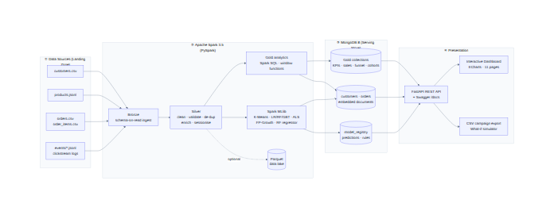

ShopSense is a **batch Big Data pipeline with a low-latency serving layer**:

1. **Landing zone**: raw files exactly as an e-commerce platform would export them: CSV tables and a folder of monthly JSON-lines click-stream logs.
2. **Processing layer (Apache Spark)**: all heavy computation (joins over ~1.4 M rows, sessionisation, aggregations, model training) runs in Spark, in parallel across CPU cores (or a cluster, by changing `SPARK_MASTER`).
3. **Serving layer (MongoDB)**: Spark writes small, query-ready *gold* documents. The dashboard never touches raw data, so every request is answered in milliseconds.
4. **Presentation layer (FastAPI + ECharts)**: a REST API over MongoDB and a single-page dashboard.

## 2. Medallion data flow

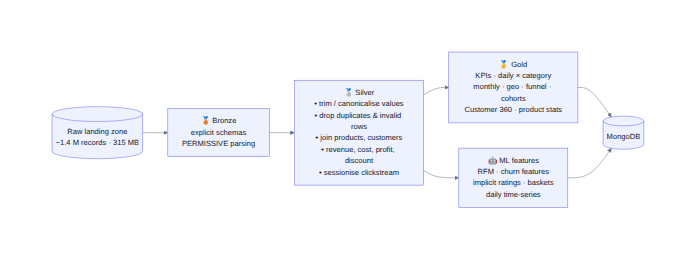

| Layer | Implemented in | What happens |
|---|---|---|
| Bronze | `shopsense/etl/ingest.py` | Explicit `StructType` schemas, `PERMISSIVE` parsing, the whole `events/` folder read in parallel |
| Silver | `shopsense/etl/clean.py` | Trim / canonicalise values (cities, payment methods, event types), drop duplicates & invalid rows, join products and customers, compute revenue / cost / profit / discount, sessionise click-stream, optional Parquet lake |
| Gold | `shopsense/analytics/*.py` | KPIs, daily × category sales, monthly trends with window functions, geo, heat-map, campaigns, funnel, cohorts, Customer 360, product stats |
| ML | `shopsense/ml/*.py` | Feature engineering + Spark MLlib training, evaluation and scoring |

### Data-quality rules (silver)

| Table | Rule | Handling |
|---|---|---|
| customers | duplicate `customer_id` | `dropDuplicates` |
| customers | blank / badly-cased city (`"  mumbai "`) | canonicalised against the city master list; blanks → `Unknown` |
| orders | duplicate `order_id` | `dropDuplicates` |
| orders | payment variants (`upi`, `" UPI "`) | mapped to canonical values |
| order_items | quantity ≤ 0 or price ≤ 0 | removed |
| events | duplicate `event_id`, upper-case types, `product_view` without product | de-duplicated, lower-cased, removed |

Counts of every fix are stored in `pipeline_runs.data_quality` and shown on the *Pipeline* page.

## 3. UML diagrams

| Diagram | File |
|---|---|
| Use-case | 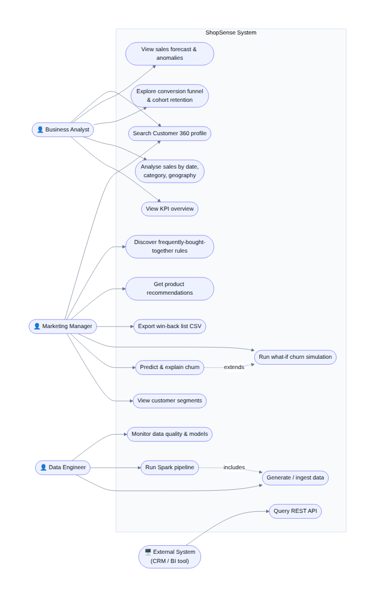 |
| Sequence: pipeline run | 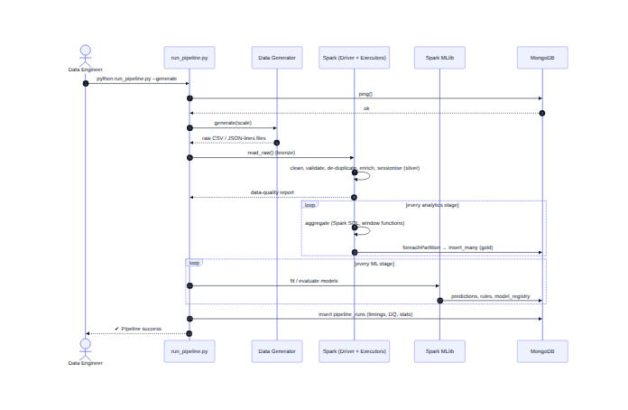 |
| Sequence: dashboard & what-if simulator | 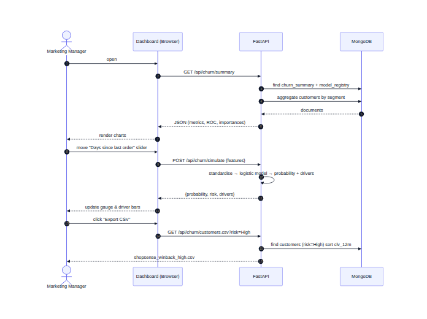 |
| State: customer lifecycle | 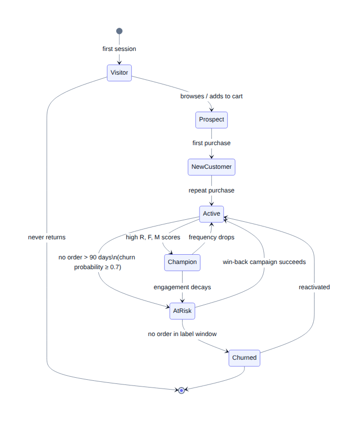 |
| State: pipeline run | 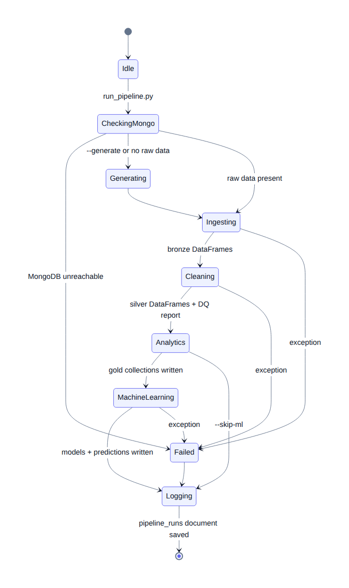 |
| DFD level 0 | 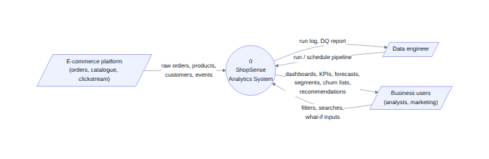 |
| DFD level 1 | 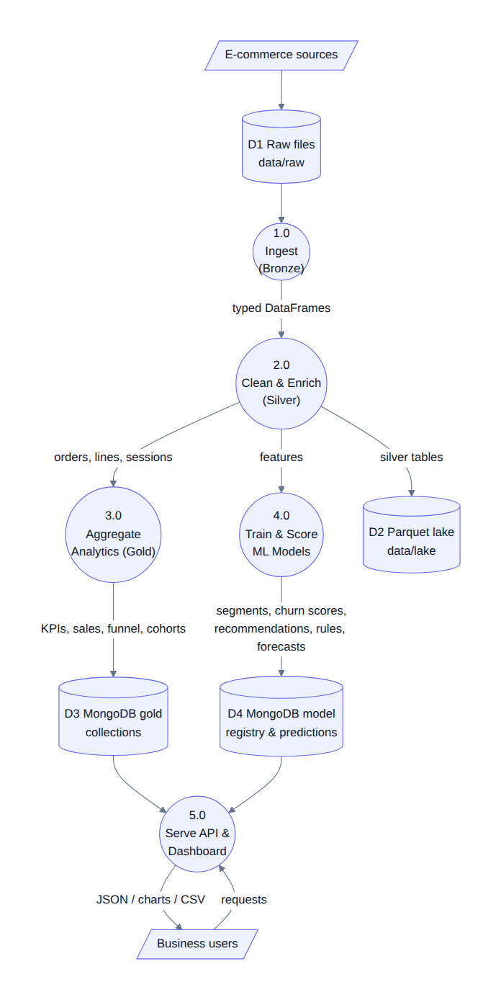 |
| Class / module | 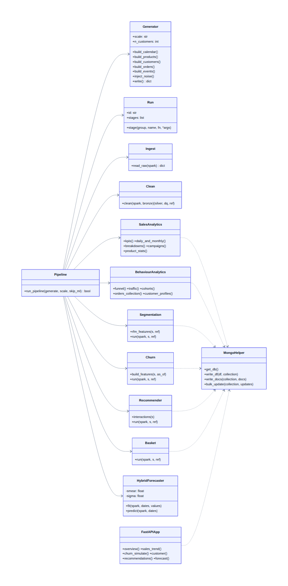 |
| Activity: churn model | 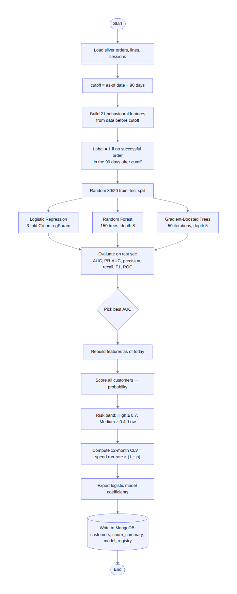 |
| Deployment | 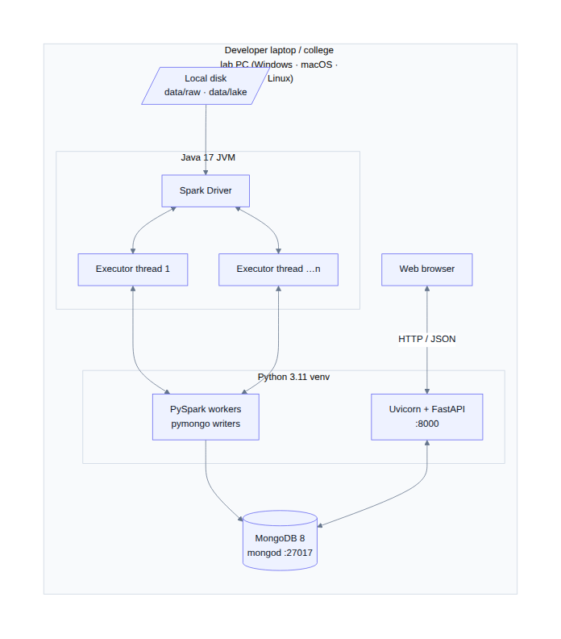 |

Sources are in `diagrams/src/*.mmd` (Mermaid). They can be edited and re-rendered at <https://mermaid.live>.

## 4. MongoDB design

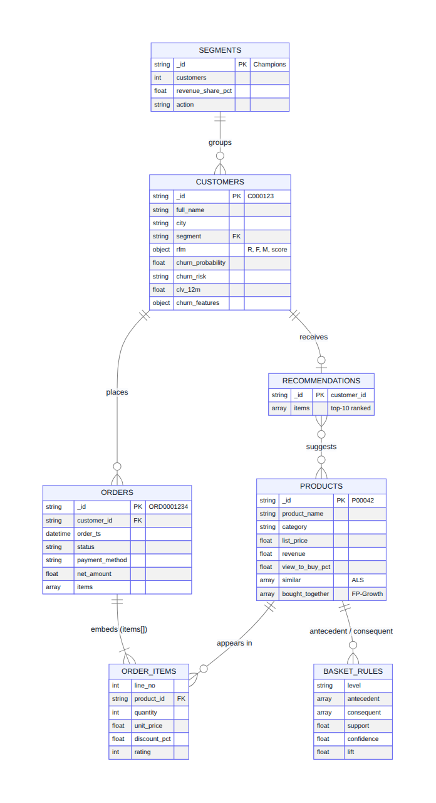

Design principles:
- **Query-shaped documents**: each dashboard widget reads one small collection, with no joins at request time.
- **Embedding** where data is read together: an `orders` document embeds its line items (`items[]`); `products` embed `similar[]` (ALS) and `bought_together[]` (FP-Growth); `customers` embed `rfm`, `churn_features` and scores.
- **Natural keys as `_id`** (`C000123`, `P00042`, `ORD0001234`) for direct look-ups.
- **Indexes** on every filter / sort field (`date`, `category`, `segment`, `customer_id`, `order_ts`, `total_spent`, …).

| Collection | Grain | Written by |
|---|---|---|
| `kpis` | 1 document | analytics.sales |
| `sales_daily`, `sales_daily_category`, `sales_monthly` | day · day × category · month | analytics.sales |
| `sales_by_category`, `sales_by_subcategory`, `sales_by_city`, `sales_by_state`, `sales_by_dimension`, `sales_heatmap`, `campaigns` | breakdowns | analytics.sales |
| `products` | product (+ similar, bought_together) | analytics.sales, ml.recommender, ml.basket |
| `funnel`, `traffic_hourly`, `traffic_monthly`, `event_counts`, `cohorts` | behaviour | analytics.behaviour |
| `orders` | order with embedded items | analytics.behaviour |
| `customers` | Customer 360 (+ segment, RFM, churn, CLV) | analytics.behaviour, ml.segmentation, ml.churn |
| `segments`, `segment_points` | segment · PCA sample | ml.segmentation |
| `churn_summary` | 1 document | ml.churn |
| `recommendations` | customer → top-10 | ml.recommender |
| `basket_rules` | association rule | ml.basket |
| `forecasts`, `anomalies` | series · anomaly | ml.forecast |
| `model_registry` | model metadata, metrics, exported LR coefficients | all ML modules |
| `pipeline_runs` | run log | pipeline |

### Distributed writes

`shopsense/mongo.py → write_df()` calls `DataFrame.foreachPartition`. Every Spark partition opens its own PyMongo connection and bulk-inserts batches of 2,000 documents, so writes scale out with the executors. Setting `MONGO_SPARK_CONNECTOR=true` switches to the official MongoDB Spark Connector (`df.write.format("mongodb")`).

## 5. Serving layer

- **FastAPI** (`app/main.py`) exposes 29 endpoints, grouped by tag in Swagger (`/docs`).
- Filters are computed with MongoDB **aggregation pipelines** (`$match`, `$group`, `$dateTrunc`, `$unwind`), for example the sales trend by week for a category and date range.
- The **churn simulator** does not need Spark at request time: the logistic-regression coefficients and the scaler's mean / std are exported to `model_registry`, and the API evaluates the model in pure Python in about 1 ms.
- The frontend is framework-free (vanilla JS, hash router). **Apache ECharts** and the **Inter** font are bundled in `app/static/vendor` and `app/static/fonts`, so the dashboard works offline.

## 6. Deployment

Everything runs on one machine in Spark *local mode* (`local[*]` uses all cores). To scale out:
- point `SPARK_MASTER` to a standalone / YARN / Kubernetes cluster,
- store the raw data on HDFS / S3 (change `DATA_DIR`),
- use a MongoDB replica set or Atlas cluster (`MONGO_URI`),
- run the API behind a reverse proxy with multiple Uvicorn workers.

## 7. Project plan

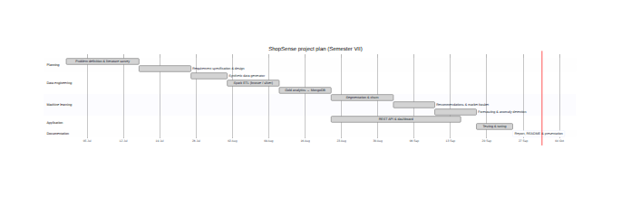
