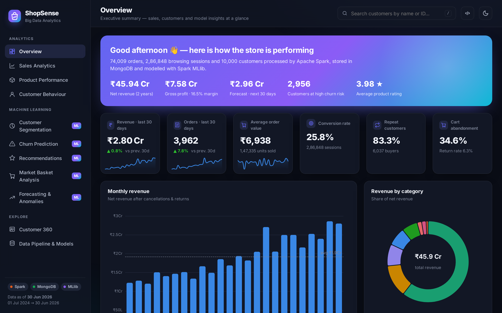
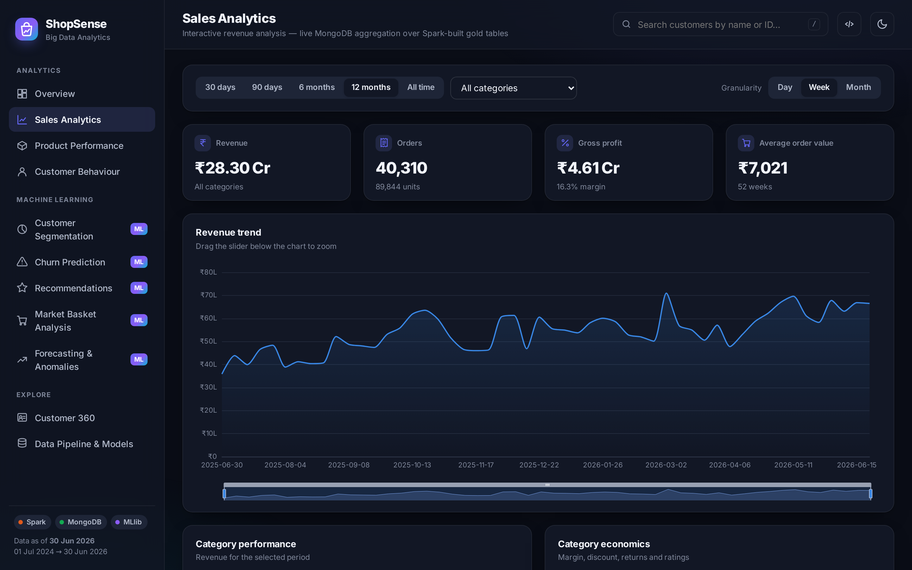
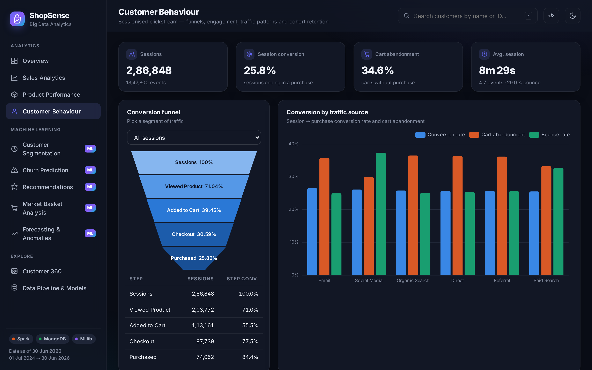
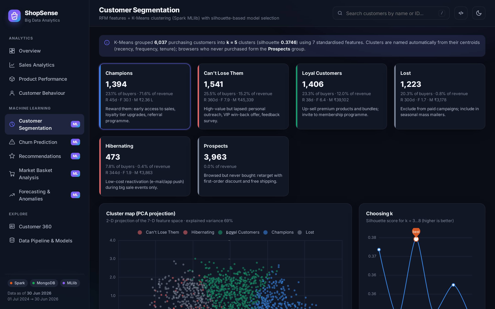
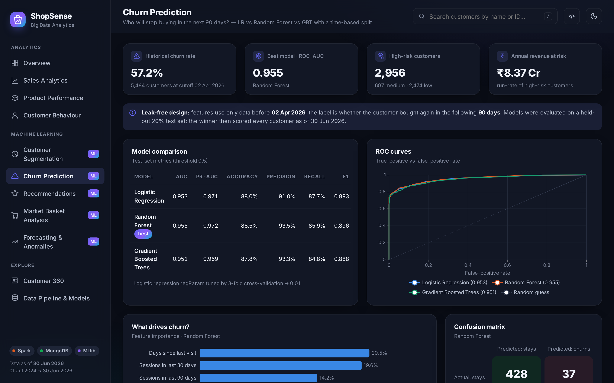
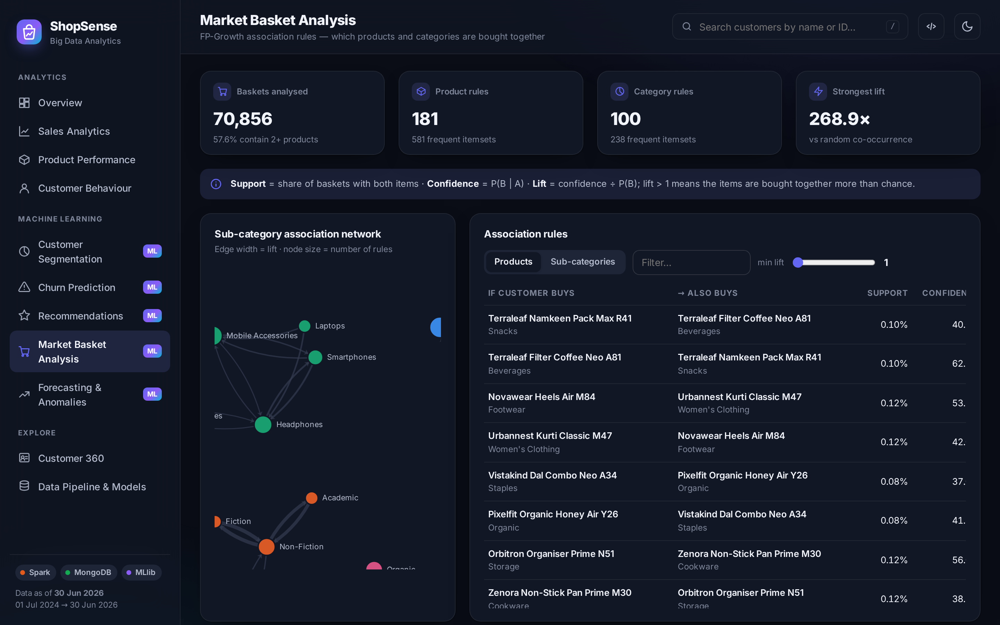
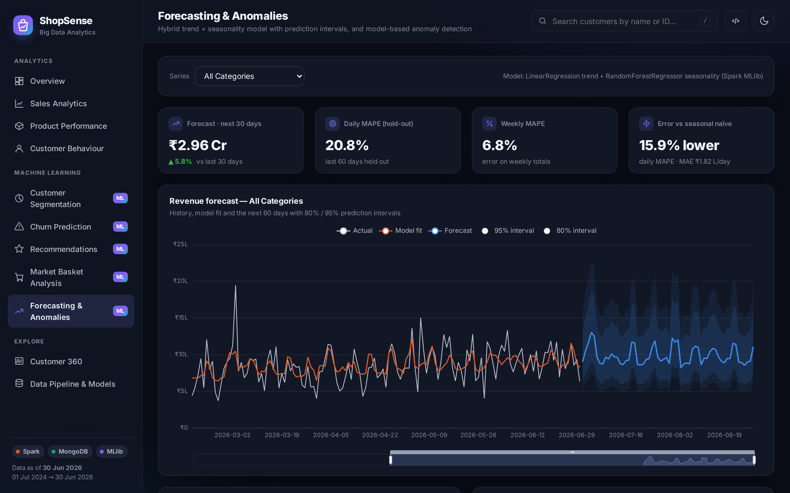
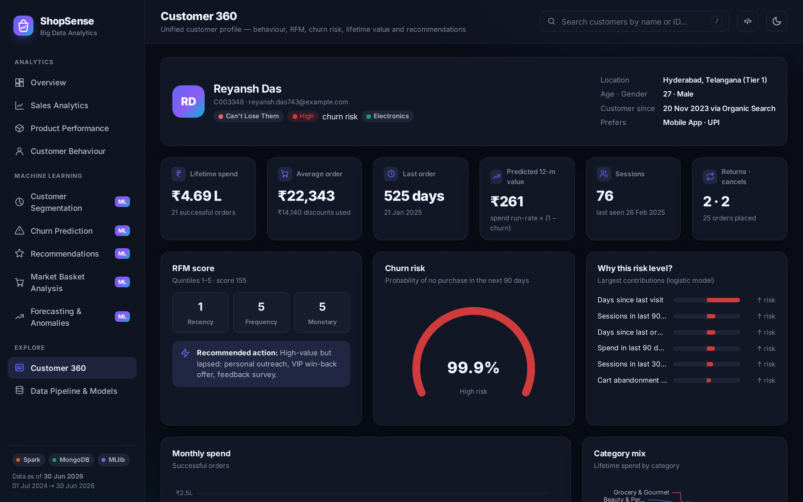
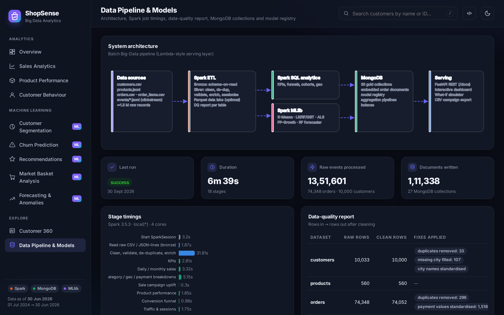

# User Guide: Dashboard Tour

Open <http://127.0.0.1:8000> after running the pipeline. The left sidebar groups the 11 pages into **Analytics**, **Machine Learning** and **Explore**.
Global controls in the top bar:

- 🔍 **Customer search**: type a name or customer ID (press <kbd>/</kbd> to focus) to jump to the Customer 360 page.
- `</>` opens the interactive **REST API documentation** (Swagger).
- ☀️ / 🌙 toggles the **light / dark theme** (remembered by the browser).

Every chart is interactive: hover for tooltips, click legend items to hide series, drag the sliders under time-series charts to zoom.

---

## Analytics

### 1. Overview

The executive summary: two-year net revenue and profit, the 30-day forecast, the number of high-churn-risk customers and the average rating.
KPI tiles compare the **last 30 days with the previous 30 days** and show monthly sparklines. Below are monthly revenue, category mix, new vs returning buyers, the conversion funnel, revenue share per segment, top products and **model-generated alerts** (anomalies, revenue at risk, forecast).

*Use case:* a manager's daily 30-second health check.

### 2. Sales Analytics

- **Filters**: date range (30 days → all time), category and granularity (day / week / month). Filters run live **MongoDB aggregation pipelines** over the Spark-built daily × category table.
- Revenue trend with zoom slider, category performance and economics (margin, discount, returns, rating).
- **Geographic bubble map** of cities (bubble = revenue) and top states.
- **Orders heat-map** (day of week × hour) shows when customers shop, which helps schedule campaigns and push notifications.
- **Treemap** of sub-categories (click to drill down).
- Payment methods with cancellation rates (Cash-on-Delivery cancels about twice as often), devices and acquisition channels.
- **Sale-event uplift**: order-volume vs revenue uplift for every sale, compared with the 28 days before it.

### 3. Product Performance
Search, filter and sort the catalogue by revenue, units, rating, conversion or returns. The scatter plot compares views with orders.
**Click a product** to see its KPIs, *frequently bought together* items (FP-Growth) and *similar products* (ALS item factors).

### 4. Customer Behaviour

Built from 1.35 million click-stream events grouped into sessions:
- **Conversion funnel** (sessions → product view → cart → checkout → purchase) for all traffic or any device / traffic source.
- Conversion, cart abandonment and bounce rates by traffic source; sessions by hour; event mix; monthly engagement.
- **Cohort retention matrix**: for customers who first bought in month M0, the share who bought again 1, 2, … 12 months later.

---

## Machine Learning

### 5. Customer Segmentation

K-Means clusters purchasing customers on RFM-style features. Each **segment card** shows size, revenue share, average recency / frequency / monetary value and a **recommended marketing action**. Click a card to list its customers.
The **PCA cluster map** shows the clusters in 2-D. The **silhouette curve** explains why k = 5 was chosen.

### 6. Churn Prediction

- Three models compared on a held-out test set (AUC, PR-AUC, accuracy, precision, recall, F1) with ROC curves and a confusion matrix.
- **What drives churn?**: feature importance of the tree model.
- **What-if simulator**: move the sliders (days since last order, sessions, spend, …) and the probability gauge updates instantly. The bars show which factors push the risk up (red) or down (green).
- **Win-back target list**: customers by risk band sorted by predicted 12-month value. Click **Export CSV** to get a campaign file for the CRM / e-mail tool.

### 7. Recommendations
Pick any customer (search box) to see what they bought recently and their **personalised Top-10** from the ALS model, each with a reason ("Because you shop Fashion"). The evaluation panel compares ALS with a popularity baseline (HitRate@10, NDCG@10) and lists the hyper-parameter grid.

### 8. Market Basket Analysis

Association rules mined with FP-Growth. Switch between **product** and **sub-category** level, filter by minimum lift or text.
The **network graph** links sub-categories that are bought together (edge width = lift). Drag nodes and zoom with the mouse wheel.
*Use cases:* bundle offers, "customers also bought" widgets and store layout.

### 9. Forecasting & Anomalies

- Choose a series (all categories or one category). The chart shows history, the model fit and a **60-day forecast with 80% / 95% prediction intervals**.
- Model vs baselines on a 60-day hold-out window, plus an actual-vs-predicted check.
- **Anomaly timeline**: days whose order volume is far from the model's expectation. The validation panel shows that all 4 events planted in the data were found.
- Order-level alerts: unusually large orders and a return-abuse watch-list.

---

## Explore

### 10. Customer 360

A single customer's complete profile: demographics, lifetime spend, AOV, recency, **predicted 12-month value**, RFM scores, **churn gauge with an explanation of the main drivers**, monthly spend, category mix, recent orders (click one to see its embedded items) and recommendations.

### 11. Data Pipeline & Models

The architecture, per-stage Spark timings, the **data-quality report** (rows in → rows out and fixes applied), the model registry with key metrics, MongoDB collection sizes and the run history.

---

## Typical workflows

| Goal | Steps |
|---|---|
| Plan a retention campaign | Churn → filter *High* → Export CSV → check a few customers in Customer 360 |
| Design a bundle offer | Market Basket → Products level → sort by confidence → open the product drawer |
| Prepare a monthly review | Overview → Sales (12 months, month granularity) → Forecast |
| Investigate a bad day | Forecast & Anomalies → anomaly table → Sales with a 30-day range |
| Personalise a newsletter | Recommendations → search the customer → use the Top-10 |
